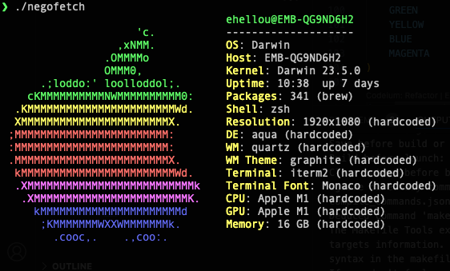

# negofetch
neofetch implementation written in Go

## About

This is a pure Go native implementation of neofetch, a known
tool to print information about the system with nice logo in
ascii art.

In the back there are some calls to shell in order to gather
data, but where it is possible, data is fetched via native
Go calls.

## Status

Right now a lot of stuff remains hard coded and sometimes only
for macOS, which is my main system right now.

I'm migrating slowly the features from neofetch to it, but I
don't believe 100% will be here.

| Object | status |
| --- | --- |
| Logo: macOS | done |
| Logo: AIX | done |
| Logo:  Hash | done |
| Logo:  Alpine | TBD |
| Logo:  alpine_small | done |
| Logo:  Amazon | done |
| Logo:  Anarchy | TBD |
| Logo:  Android | TBD |
| Logo:  Antergos | TBD |
| Logo:  antiX | TBD |
| Logo:  "AOSC OS" | TBD |
| Logo:  "AOSC OS/Retro" | TBD |
| Logo:  Apricity | TBD |
| Logo:  ArcoLinux | TBD |
| Logo:  ArchBox | TBD |
| Logo:  ARCHlabs | TBD |
| Logo:  ArchStrike | TBD |
| Logo:  XFerience | TBD |
| Logo:  ArchMerge | TBD |
| Logo:  Arch | TBD |
| Logo:  Artix | TBD |
| Logo:  Arya | TBD |
| Logo:  Bedrock | TBD |
| Logo:  Bitrig | TBD |
| Logo:  BlackArch | TBD |
| Logo:  BLAG | TBD |
| Logo:  BlankOn | TBD |
| Logo:  BlueLight | TBD |
| Logo:  bonsai | TBD |
| Logo:  BSD | TBD |
| Logo:  BunsenLabs | TBD |
| Logo:  Calculate | TBD |
| Logo:  Carbs | TBD |
| Logo:  CentOS | TBD |
| Logo:  Chakra | TBD |
| Logo:  ChaletOS | TBD |
| Logo:  Chapeau | TBD |
| Logo:  Chrom* | TBD |
| Logo:  Cleanjaro | TBD |
| Logo:  ClearOS | TBD |
| Logo:  Clear_Linux | TBD |
| Logo:  Clover | TBD |
| Logo:  Condres | TBD |
| Logo:  Container_Linux | TBD |
| Logo:  CRUX | TBD |
| Logo:  Cucumber | TBD |
| Logo:  Debian | TBD |
| Logo:  Deepin | TBD |
| Logo:  DesaOS | TBD |
| Logo:  Devuan | TBD |
| Logo:  DracOS | TBD |
| Logo:  DarkOs | TBD |
| Logo:  DragonFly | TBD |
| Logo:  Drauger | TBD |
| Logo:  Elementary | TBD |
| Logo:  EndeavourOS | TBD |
| Logo:  Endless | TBD |
| Logo:  EuroLinux | TBD |
| Logo:  Exherbo | TBD |
| Logo:  Fedora | TBD |
| Logo:  Feren | TBD |
| Logo:  FreeBSD | TBD |
| Logo:  FreeMiNT | TBD |
| Logo:  Frugalware | TBD |
| Logo:  Funtoo | TBD |
| Logo:  GalliumOS | TBD |
| Logo:  Garuda | TBD |
| Logo:  Gentoo | TBD |
| Logo:  Pentoo | TBD |
| Logo:  gNewSense | TBD |
| Logo:  GNOME | TBD |
| Logo:  GNU | TBD |
| Logo:  GoboLinux | TBD |
| Logo:  Grombyang | TBD |
| Logo:  Guix | TBD |
| Logo:  Haiku | TBD |
| Logo:  Huayra | TBD |
| Logo:  Hyperbola | TBD |
| Logo:  janus | TBD |
| Logo:  Kali | TBD |
| Logo:  KaOS | TBD |
| Logo:  KDE_neon | TBD |
| Logo:  Kibojoe | TBD |
| Logo:  Kogaion | TBD |
| Logo:  Korora | TBD |
| Logo:  KSLinux | TBD |
| Logo:  Kubuntu | TBD |
| Logo:  LEDE | TBD |
| Logo:  LFS | TBD |
| Logo:  Linux_Lite | TBD |
| Logo:  LMDE | TBD |
| Logo:  Lubuntu | TBD |
| Logo:  Lunar | TBD |
| Logo:  macos | TBD |
| Logo:  Mageia | TBD |
| Logo:  MagpieOS | TBD |
| Logo:  Mandriva | TBD |
| Logo:  Manjaro | TBD |
| Logo:  Maui | TBD |
| Logo:  Mer | TBD |
| Logo:  Minix | TBD |
| Logo:  LinuxMint | TBD |
| Logo:  MX_Linux | TBD |
| Logo:  Namib | TBD |
| Logo:  Neptune | TBD |
| Logo:  NetBSD | TBD |
| Logo:  Netrunner | TBD |
| Logo:  Nitrux | TBD |
| Logo:  NixOS | TBD |
| Logo:  Nurunner | TBD |
| Logo:  NuTyX | TBD |
| Logo:  OBRevenge | TBD |
| Logo:  OpenBSD | TBD |
| Logo:  openEuler | TBD |
| Logo:  OpenIndiana | TBD |
| Logo:  openmamba | TBD |
| Logo:  OpenMandriva | TBD |
| Logo:  OpenStage | TBD |
| Logo:  OpenWrt | TBD |
| Logo:  osmc | TBD |
| Logo:  Oracle | TBD |
| Logo:  OS Elbrus | TBD |
| Logo:  PacBSD | TBD |
| Logo:  Parabola | TBD |
| Logo:  Pardus | TBD |
| Logo:  Parrot | TBD |
| Logo:  Parsix | TBD |
| Logo:  TrueOS | TBD |
| Logo:  PCLinuxOS | TBD |
| Logo:  Peppermint | TBD |
| Logo:  popos | TBD |
| Logo:  Porteus | TBD |
| Logo:  PostMarketOS | TBD |
| Logo:  Proxmox | TBD |
| Logo:  Puppy | TBD |
| Logo:  PureOS | TBD |
| Logo:  Qubes | TBD |
| Logo:  Radix | TBD |
| Logo:  Raspbian | TBD |
| Logo:  Reborn_OS | TBD |
| Logo:  Redstar | TBD |
| Logo:  Redcore | TBD |
| Logo:  Redhat | TBD |
| Logo:  Refracted_Devuan | TBD |
| Logo:  Regata | TBD |
| Logo:  Rosa | TBD |
| Logo:  sabotage | TBD |
| Logo:  Sabayon | TBD |
| Logo:  Sailfish | TBD |
| Logo:  SalentOS | TBD |
| Logo:  Scientific | TBD |
| Logo:  Septor | TBD |
| Logo:  SereneLinux | TBD |
| Logo:  SharkLinux | TBD |
| Logo:  Siduction | TBD |
| Logo:  Slackware | TBD |
| Logo:  SliTaz | TBD |
| Logo:  SmartOS | TBD |
| Logo:  Solus | TBD |
| Logo:  Source_Mage | TBD |
| Logo:  Sparky | TBD |
| Logo:  Star | TBD |
| Logo:  SteamOS | TBD |
| Logo:  SunOS | TBD |
| Logo:  openSUSE_Leap | TBD |
| Logo:  openSUSE_Tumbleweed | TBD |
| Logo:  openSUSE | TBD |
| Logo:  SwagArch | TBD |
| Logo:  Tails | TBD |
| Logo:  Trisquel | TBD |
| Logo:  Ubuntu-Budgie | TBD |
| Logo:  Ubuntu-GNOME | TBD |
| Logo:  Ubuntu-MATE | TBD |
| Logo:  Ubuntu-Studio | TBD |
| Logo:  Ubuntu | TBD |
| Logo:  Venom | TBD |
| Logo:  Void | TBD |
| Logo:  Obarun | TBD |
| Logo:  windows10 | TBD |
| Logo:  Windows7 | TBD |
| Logo:  Xubuntu | TBD |
| Logo:  Zorin | TBD |
| Logo:  IRIX | TBD |
| Logo:  Arch | TBD |
| Logo:  Ubuntu | TBD |
| Logo:  Redhat | TBD |
| Logo:  Dragonfly | TBD |
| Logo:  Ubuntu | TBD |
| Logo:  Lubuntu | TBD |
| Logo:  Kubuntu | TBD |
| Logo:  Xubuntu | TBD |
| Logo:  Ubuntu-GNOME | TBD |
| Logo:  Ubuntu-Studio | TBD |
| Logo:  Ubuntu-Mate | TBD |
| Logo:  Ubuntu-Budgie | TBD |
| Logo:  Arcolinux | TBD |
| Logo:  Dragonfly | TBD |
| Logo:  Fedora | TBD |
| Logo:  Alpine | TBD |
| Logo:  Arch | TBD |
| Logo:  Ubuntu | TBD |
| Logo:  CRUX | TBD |
| Logo:  Debian | TBD |
| Logo:  Gentoo | TBD |
| Logo:  FreeBSD | TBD |
| Logo:  Mac | TBD |
| Logo:  NixOS | TBD |
| Logo:  OpenBSD | TBD |
| Logo:  android | TBD |
| Logo:  Antrix | TBD |
| Logo:  CentOS | TBD |
| Logo:  Cleanjaro | TBD |
| Logo:  ElementaryOS | TBD |
| Logo:  GUIX | TBD |
| Logo:  Hyperbola | TBD |
| Logo:  Manjaro | TBD |
| Logo:  MXLinux | TBD |
| Logo:  NetBSD | TBD |
| Logo:  Parabola | TBD |
| Logo:  POP_OS | TBD |
| Logo:  PureOS | TBD |
| Logo:  Slackware | TBD |
| Logo:  SunOS | TBD |
| Logo:  LinuxLite | TBD |
| Logo:  OpenSUSE | TBD |
| Logo:  Raspbian | TBD |
| Logo:  postmarketOS | TBD |
| Option: ascii_art | done |
| Username @ hostname | done |
| OS | in progress |
| Host | done |
| Kernel | in progress |
| Uptime | in progress |
| Packages | in progress |
| Shell | in progress |
| Resolution | TBD |
| DE | TBD |
| WM | TBD |
| WM Theme | TBD |
| Terminal | TBD |
| Terminal Font | TBD |
| CPU | TBD |
| GPU | TBD |
| Memory | TBD |
| Color bar | TBD |
| Position information | Done|
| Color system | Done |
| --- | --- |

## Warning

This project is built using AI coding assistant.  That means it might change
the license due copywrite issue.
